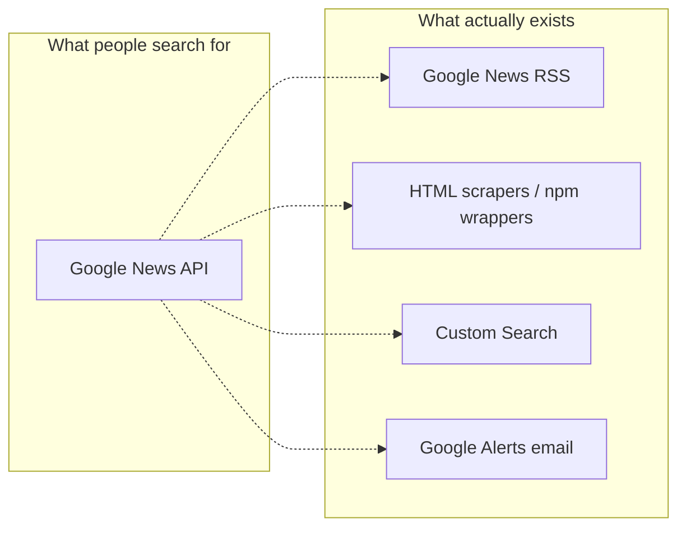
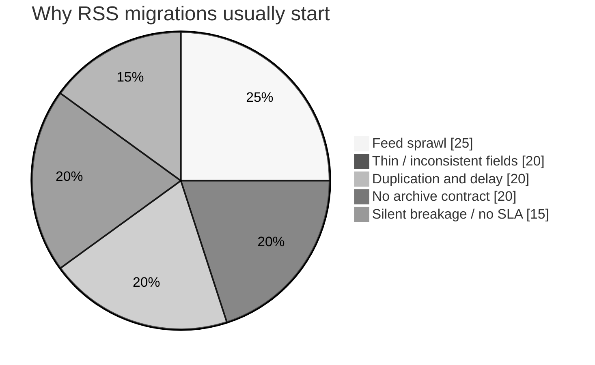
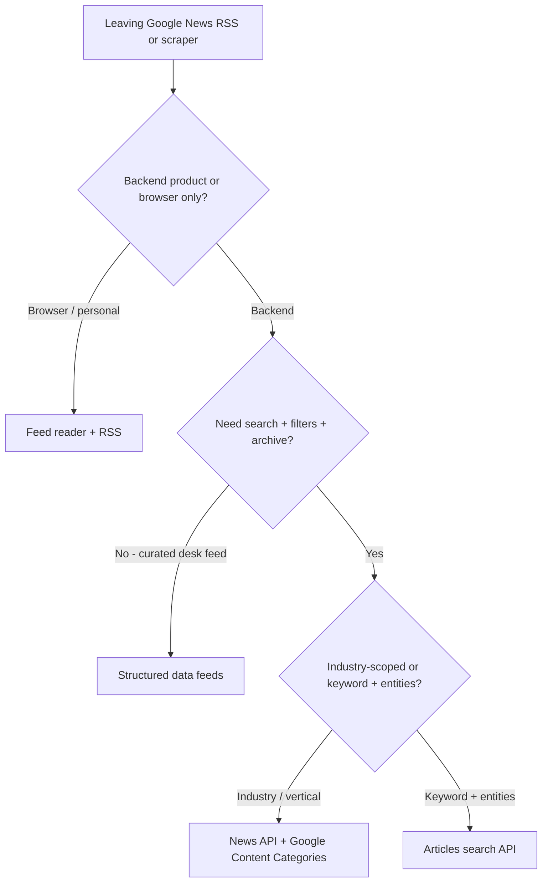
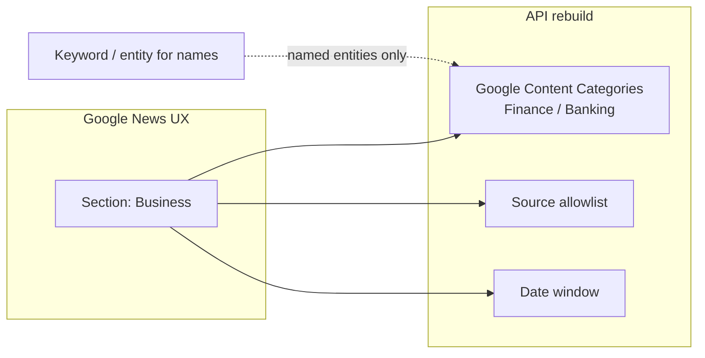
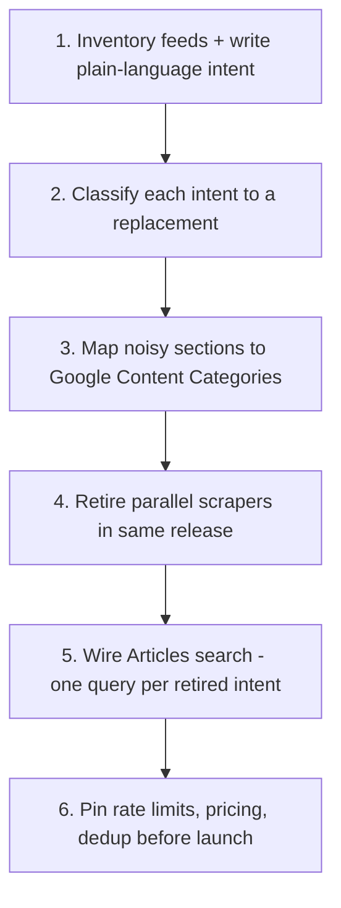

# Google News API Alternatives: Google Has No Official API - What to Use Instead

**There is no official Google News API.** Developers still search for a **google news api** every week, but Google does not ship a supported public News API for backends. What exists instead: RSS URLs, HTML scrapers, and third-party **Google News API alternatives**. Treat anything labeled "Google News API" in a tutorial as unofficial.

This page is a **migration guide**: what people meant by the phrase, why those paths break, and what to use instead (RSS, structured feeds, or a real news API).

---

## What "Google News API" usually means

| Expectation | Reality |
|-------------|---------|
| Official REST News API from Google | **Does not exist** as a public product |
| Google News RSS subscription URLs | Unofficial topic/query feeds - fine for readers, thin for products |
| Google Custom Search | Web search, not a news index with enrichment |
| npm / PyPI "google-news" wrappers | HTML scrapers - brittle, ToS risk, no SLA |
| Google Alerts digests | Notifications, not a queryable data layer |

If you need "every article about Company X from these forty domains since January," you are already past what Google ships.

---

## Myths that keep the search alive

| Myth | Truth |
|------|-------|
| Google deprecated a News API | Never launched a documented, key-based News search API |
| Custom Search is the same thing | Web search slice - not news fields, publisher metadata, or industry categories |
| Thousands of npm downloads = production-ready | Downloads measure convenience, not uptime when markup changes |
| RSS is a free API | Syndication format - no cross-source boolean, entities, clustering, or SLA |
| Scraping is a harmless shortcut | ToS, IP blocks, silent HTML changes - you own maintenance forever |
| Any news API is interchangeable | Vendors differ on sources, archive, enrichment, categories, pricing |

---

## Why Google News RSS stops working for products

Personal skim: fine. Product backend: hits structural limits fast.

| Failure mode | What happens |
|--------------|--------------|
| **Feed sprawl** | Ten competitors × twenty markets = hundreds of URLs |
| **Thin fields** | Title, link, teaser, date - no entities, categories, cluster IDs |
| **Delay + duplication** | Poll schedule lags; wires reprint without narrative dedup |
| **Query rigidity** | One URL = one interest shape; OR / exclude / metro = more feeds |
| **No archive** | Forward-only; last-quarter rebuild is painful or impossible |
| **Silent breakage** | Empty feeds, URL shape changes, throttles - no SLA |

When RSS stops working, next step is **structured feeds** or a **news API** - not another aggregator rule. Product decision: [Google RSS vs structured data feeds](https://perigon.io/blog/google-rss-vs-perigon-data-feeds).

---

## Scraper and unofficial library risks

Packages named like SDKs (`google-news`, `gnews`, …) usually parse HTML. Fine for a hackathon; risky for uptime.

| Risk | In production |
|------|---------------|
| Markup changes | Job "succeeds" with zero rows |
| Rate limits / blocks | Cloud IPs challenged; retries amplify cost |
| ToS exposure | Legal flags scraping you do not license |
| Schema drift | Title/date/source shapes change feed to feed |
| No enrichment | NER, categories, dedup stay in-house |
| Security | Unmaintained transitive deps |

Migration = **replacing an unowned integration**, not swapping API keys. Inventory fields you actually consume, then decide parity vs net-new enrichment.

---

## Decision tree: pick your alternative

| Path | When |
|------|------|
| **RSS / reader** | Human skim, short outlet list, no shared structured data |
| **Structured feeds** | Shared desk tracker, minimal code |
| **News API** | Code must query, filter, store, alert |
| **+ Google Content Categories** | Vertical products (finance, health, energy, sports) |
| **Articles search leaf** | Replace RSS polling with programmatic search - walkthrough: [Google has no News API](https://perigon.io/blog/google-has-no-news-api-perigon-does-search-articles-apply-filters-and-build-feeds) |

---

## Alternative patterns (architecture first)

| Pattern | Best for | Limit |
|---------|----------|-------|
| **RSS / Atom** | Solo analyst, ≤10 stable outlets | No entities; duplicates; no SLA |
| **Structured news feeds** | Shared desk tracker, minimal code | Less flexible than custom boolean |
| **News API** | Apps, alerts, ETL | Pick by enrichment, archive, price |
| **News API + categories** | Vertical products | Needs real taxonomy depth, not just Business tags |
| **Event datasets (GDELT, etc.)** | Academic / geopolitical research | Engineering-heavy |
| **Web search APIs** | Find pages on these domains | Not a news index |

Choose pattern first, vendor second. Free-tier traps and eight-vendor matrices live in companion posts in this series.

---

## Google News sections vs API categories

Website **sections** (Business, Health, Tech) are presentation buckets - not a stable query language. Keyword stand-ins fail: `bank`, `apple`, `java` all collide.

**Google Content Categories** = hierarchical industry paths on articles (e.g. Finance / Banking). Target a leaf or a whole branch. Combine with date, publisher, language, and exclude rules for opinion/paid. Keyword search still matters for named entities; categories carry the industry shape.

Parameter walkthrough: [Filter news by Google Content Categories](https://perigon.io/blog/news-api-filter-by-google-taxonomy).

---

## Migration from Google News RSS

Migrate by **intent**, not URL clone.

| RSS intent shape | Typical replacement |
|------------------|---------------------|
| Single publisher firehose | Domain filter on news API, or keep publisher RSS if volume is low |
| Google News query / topic | Keyword + date, or category if it was really a section |
| Multi-outlet desk, no code | Structured data feed |
| Alerting on new matches | News API + incremental poll (`addDateFrom`) |
| What happened last quarter | News API archive window - RSS cannot do this |

Practical API walkthrough: [Google has no News API](https://perigon.io/blog/google-has-no-news-api-perigon-does-search-articles-apply-filters-and-build-feeds). Plan limits: [API pricing](https://perigon.io/products/pricing/apis).

---

## Migration from unofficial libraries

| Step | Action |
|------|--------|
| **Stop on next break** | No more HTML parser forks; shadow-run a vendor API |
| **Match fields you use** | Usually title, URL, date, source - enrichment only if the product needs it |
| **Make newsiness explicit** | Exclude opinion, require language, restrict sources, scope categories |
| **Handle pagination** | Scrapers truncated silently; APIs paginate openly |
| **Log query definitions** | Keywords, sources, categories, dates in config - not selector soup |
| **Backfill archive** | If scraper only fetched today, fill history once so dashboards are not empty |

---

## Migration checklist

**Discovery**
- [ ] List every RSS URL, scraper cron, and Google Alerts feed into production
- [ ] Write plain-language intent for each
- [ ] Mark archive depth vs forward-only
- [ ] Flag noisy queries that were really section browsing

**Architecture**
- [ ] Backend vs reader-only
- [ ] RSS / structured feed / news API per intent
- [ ] Vertical desks: plan Google Content Category mapping before keyword cloning

**Vendor / feed**
- [ ] Publisher coverage for your allowlist
- [ ] Trial covers poll volume; price at 2× growth
- [ ] Filter support: sources, dates, categories, labels

**Implementation**
- [ ] Shadow pipeline one week; compare noise
- [ ] Map schema; drop unused enrichment
- [ ] Replace scraper cron with API poll or webhook
- [ ] Store query defs in config

**Cutover**
- [ ] One release retires scrapers
- [ ] Alerts and dashboards read the new store
- [ ] Runbook: rate limits + vendor status page

**Post-migration**
- [ ] Review duplicates / false positives after two weeks
- [ ] Tune categories vs keywords
- [ ] Delete dead RSS URLs from docs

---

## FAQ

**Does Google have a News API? Is it deprecated?**  
**No.** Never a supported public product. RSS and scrapers are unofficial - treat them as deprecated for production backends.

**What is the best alternative?**  
Personal: RSS or structured feed. Backend search + archive: news API. Vertical products: search + Google Content Categories. No single name replaces a product Google never defined.

**Can I still use Google News RSS?**  
Yes for personal use and small lists. Leave when you need cross-source filters, dedup, entities, shared surfaces, or history.

**Does Custom Search replace a news API?**  
Only for narrow domain search. No consistent news schema, categories, or clustered coverage out of the box.

**Are npm google-news packages safe?**  
Demos maybe. Production: plan migration. Assume zero notice on HTML change.

**How do I rebuild a Google News section?**  
Hierarchical Google Content Categories + source and date filters. Keyword-only clones decay.

**Do I need the most expensive tier?**  
Not always. Parity (title, URL, date, source) fits lower tiers. Vertical enrichment, archives, and high poll rates drive cost.

**What about Google Alerts?**  
Email notifications, not a query layer. Parsing email is another brittle integration.

---

## Key takeaways

- **Google never offered a supported public News API** - RSS and scrapers filled the gap unofficially
- **RSS fails in products** via sprawl, thin fields, delay, duplication, and no archive
- **Scrapers trade short-term speed for long-term incidents**
- **Pick the pattern first**, then shortlist vendors
- **Sections are not queries** - rebuild with Google Content Categories + sources/dates
- **Migrate by intent, not URL** - inventory, map, shadow-run, single cutover
- After cutover, storyline alerts: [breaking news API: monitor news trends](https://perigon.io/blog/breaking-news-api-monitor-news-trends)
